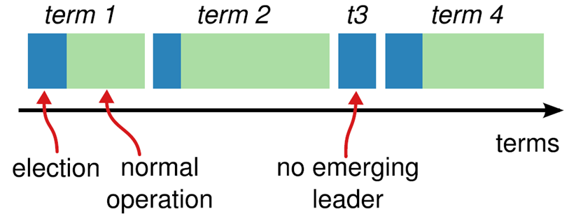

# Raft

raft将一致性分解为多个子问题。

- leader选举策略（leader election）
- 日志同步（log replication）
- 安全性（safety）
- 日志压缩（log compaction）
- 成员变更（Membership change）

### leader

接收客户端请求，并向follower同步请求日志，当日志同步到大多数节点上后告诉follower提交日志。

### follower

接受并持久化leader同步的日志，在leader告知日志可以提交之后，提交日志。

### candidate

leader选举过程中的临时role。

# summary

raft 算法将时间分为一个一个的term，每个term的开始都是leader election。在成功选举leader之后，leader会在整个term内管理整个集群。如果leader选举失败，该term就会因为没有leader而结束。

## leader选举

raft使用心跳（heartbeat）触发leader选举。当服务器启动的时候，初始化为follower。leader向所有followers周期性发送hearbeat。如果follower在选举超时时间内没有收到leader的hearbeat，就会等待一段随机的时间后发起一次leader的选举。

follower将其当前term逐一转换为candidate。它首先给自己投票，并给集群中的其他服务器发送requestvote RPC。结果如下：

1. 赢得了多数的选票，成功选举为leader。
2. 收到leader的消息，表示有其他服务器已经抢先当选了leader。
3. 没有服务器赢得多数的选票，leader选举失败，等待选举时间结束之后发起下一次选举。

选举出leader之后，leader通过定期向所有followers发送心跳信息维持其通知。若follower一段时间未收到leader的心跳则认为leader可能已经宕机，再次发起leader选举过程。

raft保证选举出的leader上一定具有最新的以提交的日志。

## 日志同步

leader选举出之后，就开始接收客户端的请求。leader把请求作为log entry，加入到它的日志中，然后并行的想其他服务器发起 AppendEntries RPC，append 日志。当这条日志被复制到大多数服务器上，leader将这条日志应用到它的状态机，并向客户端返回执行的结果。

部分的follower没有成功的append log entries，leader会不断的重试 appendEntries RPC，直至所有的followers都存储了所有的日志条目。

日志由有序编号（log index）的日志条目组成。每一个日志entry都包含它被创建时的term index，和用于状态机执行的命令。如果一个日志entry被复制到大多数的服务器上，就被认为可以commit了。

**raft保证：**

- 如果不同日志中的两个条目有着相同的index和term index，则他们所存储的命令是相同的。
- 如果不同日志中的两个条目有着相同的索引和任期号，则他们之前的所有条目都是完全一样的。

leader通过强制followers复制leader上的日志来处理日志的不一致，followers的不一致的日志会被leader的日志覆盖。

leader为了使followers的日志同自己的一直，leader需要知道followers同它的日志一直的地方，然后覆盖followers在该位置之后的日志条目。

Leader会从后往前试，每次AppendEntries失败后尝试前一个日志条目，直到成功找到每个Follower的日志一致位点，然后向后逐条覆盖Followers在该位置之后的条目。

## 成员变更

成员变更是在集群运行过程中副本发生变化，若增减副本数，节点替换等。

成员变更也是一个分布式一致性问题，及所有服务器对新成员达成一致。但是成员变更又有着其特殊性，因为在成员变更的过程中，参与投票的进程会发生变化。

如果将成员变更当成一般的一致性问题，直接向leader发送成员变更的请求，leader复制成员变更日志，达成多数派之后提交，各服务器提交成员变更日志后从旧成员配置（Cold）切换到新成员配置（Cnew）。