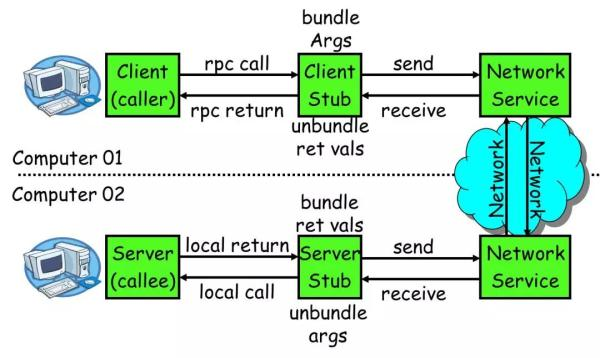

# RPC

> RPC(Remote Procedure Call)：远程过程调用，它是一种通过网络从远程计算机程序上请求服务，而不需要了解底层网络技术的思想。

## 常见的RPC技术和框架

- 应用级框架：Dubbo/Dubbox、Google gRPC
- 远程通信协议：RMI、Socket、SOAP(HTTP XML)、REST(HTTP JSON)
- 通信框架：MINA 和 Netty

### **RPC architecture summary**

- gRPC：基于HTTP/2.0 协议，并支持常见的众多变成语言。RPC框架是基于HTTP协议实现的，并使用netty来支持。
- Thrift：跨语言的服务开发框架。*用户只要在其之上进行二次开发就行，应用对于底层的 RPC 通讯等都是透明的。不过这个对于用户来说需要学习特定领域语言这个特性，还是有一定成本的。*
- Dubbo：协议和序列化框架都可以插拔是极其鲜明的特色。

## 完整的RPC框架

> 在一个典型 RPC 的使用场景中，包含了服务发现、负载、容错、网络传输、序列化等组件，其中“RPC 协议”就指明了程序如何进行网络传输和序列化。

> 如下是 Dubbo 的设计架构图，分层清晰，功能复杂：

## RPC核心功能

一个RPC的核心功能主要有5个部分组成。

**详解：**

- client：服务调用方。
- client stub：存放服务端地址信息，将客户端的request参数数据信息打包成网络消息，在通过网络传输发送给服务端。
- server stub：接受客户端发送来的request，并进行解包，再进行调用本地服务进行处理。
- server：service的提供者。
- network service：底层传输，TCP/HTTP。

## RPC核心功能实现

#### 实现技术点：

- 服务寻址
- 数据流的序列化和反序列化
- 网络传输

### 服务寻址

服务寻址可以使用Call ID进行映射。再本地调用的过程中，函数体是直接通过函数指针来指定的，但是在远程调用的过程中，函数指针是不行的，因为两个进程的地址空间是完全不一样的。

所以在RPC中，所有的函数都必须要有一个自己的ID，这个ID在所有进程中都是唯一确定的。

客户端在做远程过程调用的时候，必须附上这个ID。然后我们还需要在客户端和服务端分别维护一个函数和Call ID的对应表。

**实现：服务注册中心。e.g.：Dubbo的官方网站推荐使用zookeeper。**

##### 实现案例（RMI）

> Registry（服务发现）：借助 JNDI 发布并调用了 RMI 服务。实际上，JNDI 就是一个注册表，服务端将服务对象放入到注册表中，客户端从注册表中获取服务对象。
> RMI 服务在服务端实现之后需要注册到 RMI Server 上，然后客户端从指定的 RMI 地址上 Lookup 服务，调用该服务对应的方法即可完成远程方法调用。
> Registry 是个很重要的功能，当服务端开发完服务之后，要对外暴露，如果没有服务注册，则客户端是无从调用的，即使服务端的服务就在那里。

### 序列化和反序列化

- 将对象转换成二进制流的过程叫做序列化
- 将二进制流转换成对象的过程叫做反序列化

### 网络传输

通常 TCP 连接可以是按需连接(需要调用的时候就先建立连接，调用结束后就立马断掉)，也可以是长连接(客户端和服务器建立起连接之后保持长期持有，不管此时有无数据包的发送，可以配合心跳检测机制定期检测建立的连接是否存活有效)，多个远程过程调用共享同一个连接。

## 实现总结

- Call ID 映射：可以直接使用函数字符串，也可以使用整数 ID。映射表一般就是一个哈希表。
- 序列化反序列化：可以自己写，也可以使用 Protobuf 或者 FlatBuffers 之类的。
- 网络传输库：可以自己写 Socket，或者用 Asio，ZeroMQ，Netty 之类。

