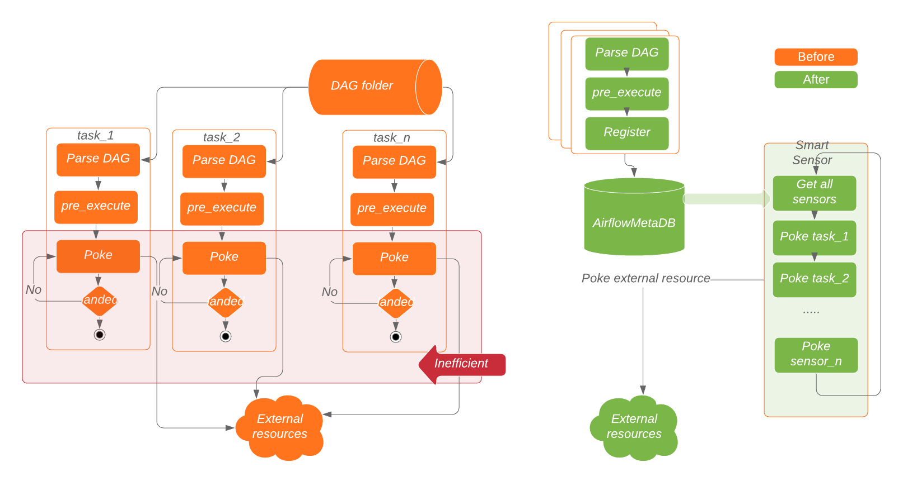
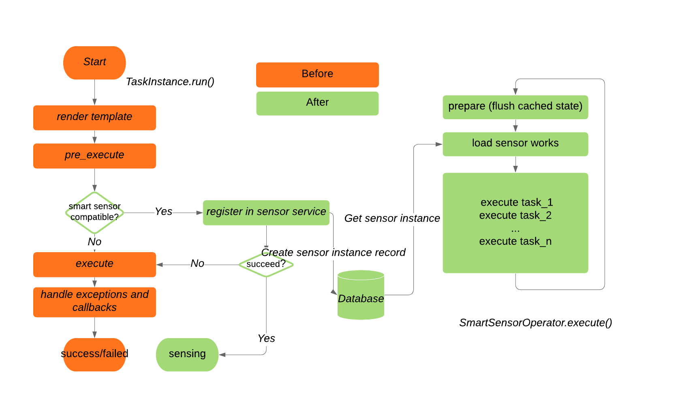

# Smart Sensor

> 在未来的版本中可能会以不兼容的方式进行调整（since 2.0.1）。而且，这个特性可以被认为是bug-free的。
> 

smart sensor是一个service（内建于DAG中）。smart sensor 通过整合一些轻量级的 task，大大降低了airflow的基础设施的成本。

smart sensor的主旨是通过中心化的进程批量执行 task 来提升 long running tasks 的执行效率。而不是为每一个 task 都提供一个 process。

为此，我们需要分两步运行任务，

1. 第一步是将任务信息序列化到数据库中，
2. 第二步是使用几个集中的流程批量执行序列化的任务。

这样，我们仅需要少数的 running process。

智能传感器服务支持一种新的模式，称为“智能传感器模式”。在智能传感器模式中，传感器将只在 sensor_instance 表中存储 poke 上下文，然后以 ` sensing `状态退出，而不是为每个传感器保持一个长时间运行的进程并周期性地戳。

当 smart senso r模式使能时，系统会创建一组特殊的内置 smart sensor DAGs(名称为smart_sensor_group_shard_xxx )；这些 dag 包括 SmartSensorOperator 任务，并管理气流集群的智能传感器工作。SmartSensorOperator 任务可以从 sensor_instance 表中获取数百个“传感”实例，并代表它们批量戳戳。用户不需要改变他们现有的 dag 。

