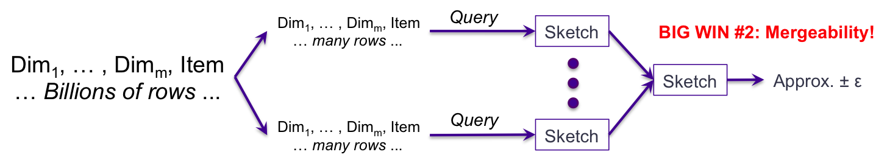
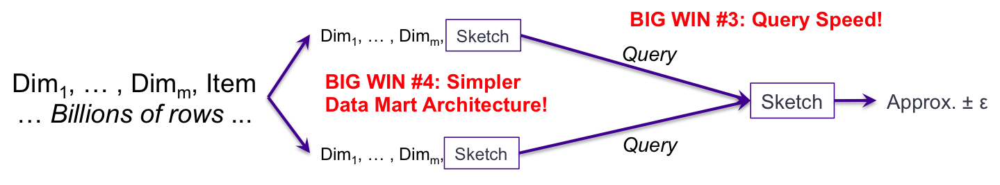
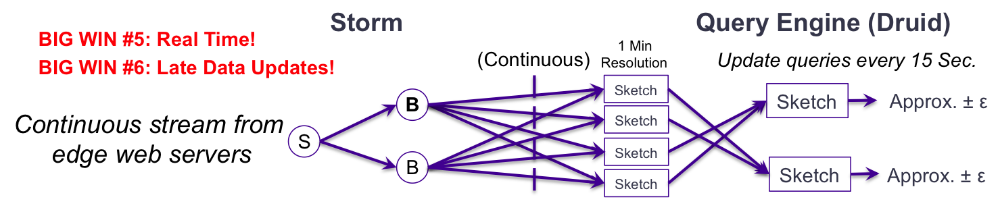

## Apache DataSketches

preface：

The business Challenge : Analyzing Big Data Quickly.

1. if approximate results are acceptable , there is a class of specialized algorithms ,called streaming algorithms, of sketches that can produce result orders-of manitude(大小,量级) faster and with mathematically proven error bonds.

then,Chinese.

### 大数据sketch处理的系统架构

1. 查询过程的大小
   1. 第一个优点时 右边查询的大小降低了许多数量级。但是，这个过程任然很慢。因为单个查询过程必须顺序扫描左边所有的原始数据。
2. 第二个优点是：Sketch可合并性支持并行化处理
   1. 第二个优点是sketch数据结构是"可合并的"，这使得并行化处理成为可能。输入数据可以被分割成许多片段。在查询阶段每个分区都使用自己的sketch。一旦所有的sketch完成了相关数据的扫描，sketch的合并就会非常快。这里提供了另一个速度性能提升。
   2. 但是有一个问题。典型的用户数据高度倾斜，不太可能均匀的划分到各个分区。处理的总体速度先择取决于负载量最重的分区。
3. 第三个优点：查询速度，架构简单
   1. 此关系图与前一个关系图的主要区别在于，在数据流中的何处执行查询，以及查询流程需要做多少工作。
   2. 这是#2对#1的改进，但是人需要查询进程在分区中处理原始数据。
   3. 如果我们在进行分区的同时对每个分区进行草图的绘制，我们就创建了一个中间的"hyper-cube"或“data-mart”的架构。其中每一行都是该分区的汇总行。中间阶段不再由任何原始数据。对于每一个维度组合，它只包含一行。该行的度量列包含让你和你需要的附加聚合的度量，以及包含二进制草图的列。在查询的时候，查询过程唯一需要做的是适当地选择查询需要的列，并从这些行中合并这些草图。我们已经测量了θ草图的合并速度，在拥有真实数据的大型系统中，速度为在每秒10到200亿之间。
4. 实时，最新的数据更新
   1. 通过storm处理来自比边缘web服务器连续实时流是可能的。storm将stream分裂成多个基于维度的并行流。这些可以被实时摄入到Druid中，并直接传送到由时间和维度组合而成的草图中。
   2. 报告web服务器 以15秒的间隔查询这些1分钟的草图。
   3. 如果没有草图那么实时就不可行。另外，这些草图可以使用罪行的数据正确的被更新，这在移动流量中经常发生。