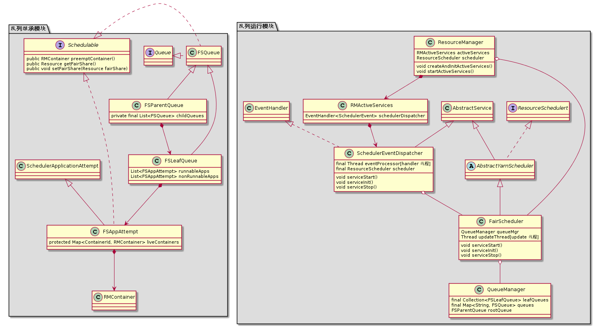

# yarn fair scheduler

## properties summary

| properties                                                   | descreption                                                  |
| ------------------------------------------------------------ | ------------------------------------------------------------ |
| yarn.scheduler.fair.preemption.cluster-utilization-threshold | The utilization threshold after which preemption kicks in. The utilization is computed as the maximum ratio of usage to capacity among all resources. Defaults to 0.8f. |
| yarn.scheduler.fair.update-interval-ms                       | The interval at which to lock the scheduler and recalculate fair shares, recalculate demand, and check whether anything is due for preemption. Defaults to 500 ms. |
| maxAMShare                                                   | limit the fraction of the queue’s fair share that can be used to run application masters. This property can only be used for leaf queues. For example, if set to 1.0f, then AMs in the leaf queue can take up to 100% of both the memory and CPU fair share. The value of -1.0f will disable this feature and the amShare will not be checked. The default value is 0.5f. |
| minSharePreemptionTimeout                                    | number of seconds the queue is under its minimum share before it will try to preempt containers to take resources from other queues. If not set, the queue will inherit the value from its parent queue. |
| fairSharePreemptionTimeout                                   | number of seconds the queue is under its fair share threshold before it will try to preempt containers to take resources from other queues. If not set, the queue will inherit the value from its parent queue. |
| fairSharePreemptionThreshold                                 | If the queue waits fairSharePreemptionTimeout without receiving  fairSharePreemptionThreshold*fairShare resources, it is allowed to preempt containers to take resources from other queues. If not set, the queue will inherit the value from its parent queue. |

## fair scheduler process architecture

fair scheduler运行流程会通过RM来启用公平调度器和调度分发器两个服务，这两个服务各自负责update线程，handler线程。

- update线程主要有两个任务
  - 更新各个队列的资源（Instantaneous fair share）
  - 判断各个leaf队列是否需要抢占式资源（如果开启抢占式功能）
- handle线程主要是处理一些时间响应，比如集群增加节点，队列增减、删除application，etc。

## fair scheduler class architecture

**FairScheduler类管理update线程，通过QueueManager获取所有队列信息。**

### 队列继承模块

yarn通过树形结构来管理队列。

从管理资源角度来看，树的根节点root队列（FSParentQueue）,非根节点（FSParentQueue），叶子节点（FSLeaf）,app任务（FSAppAttempt，公平调度器角度的App）都是抽象的资源，它们都实现了Schedulable接口，都是一个**可调度资源对象**。

它们都有自己的fair share（队列的资源量）方法（这里又用到了fair share概念），weight属性（权重）、minShare属性（最小资源量）、maxShare属性(最大资源量)，priority属性(优先级)、resourceUsage属性（资源使用量属性）以及资源需求量属性(demand)，同时也都实现了preemptContainer抢占资源的方法，assignContainer方法（为一个**ACCEPTED**的APP分配AM的container）。

### 队列运行模块

从类图角度描述公平调度的工作原理。SchedulerEventDispatcher类负责管理handle线程。	

## Instantaneous Fair Share & Steady Fair Share

Fair Share指的都是Yarn根据每个队列的权重、最大，最小可运行资源计算的得到的可以分配给这个队列的最大可用资源。本文描述的是公平调度，公平调度的**默认策略FairSharePolicy**的规则是**single-resource**，即只关注内存资源这一项指标。